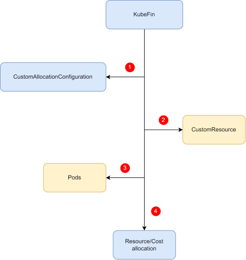

# CustomAllocationConfiguration

In the Kubernetes ecosystem, there are numerous CustomResources, and achieving visualization of resources and costs for these CustomResources is a significant challenge. To address this, KubeFin has designed and implemented the CustomAllocationConfiguration, which enables visualization of resources and costs for various CustomResources (CRs).

## How does it work?

Initially, clients must define how a type of CustomResource maps to the corresponding Pods through the configuration of CustomAllocationConfiguration. KubeFin will then parse the resources and costs of the corresponding Pods, thereby conducting a cost analysis of the custom resources.

Let's take a look at the definition of `CustomAllocationConfiguration`:

```yaml
apiVersion: insight.kubefin.dev/v1alpha1
kind: CustomAllocationConfiguration
metadata:
  name: name-of-custom-allocation-configuration
spec:
  workloadsAllocation:
  - workloadTypeAlias: workload-type-alias
    target:
      apiVersion: apiVersion-of-target
      kind: kind-of-target
    podLabelSelectorExtract:
      # lua script
      script: |
        function ExtractPodLabelSelector (observedObj)
          # Return a key/value map as pod label selector
          # It will list the pods with the parsed label selector
        end
```

In this configuration:
* `workloadTypeAlias` represents the alias type of a CustomResource.
* `target` is the corresponding CustomResource.
* `podLabelSelectorExtract` is a Lua script used to extract a Pod's label selector from CR.

Finally, identifying the corresponding Pods to calculate their allocations. The overall workflow is as follows:



1. KubeFin lists and watches all CustomAllocationConfiguration objects, caching them locally.
1. Based on CustomAllocationConfiguration, KubeFin finds the targeted resources through `spec.workloadsAllocation[*].target`; concurrently, after finding the target resources, KubeFin invokes the script specified in `spec.workloadsAllocation[*].podLabelSelectorExtract` with CustomResource as a parameter to parse the corresponding Pod's LabelSelector.
1. With the LabelSelector parsed in the previous step, all Pods for this CustomResource are retrieved.
1. Based on the retrieved Pods, the resource/cost allocation for the respective CustomResource is calculated.

## What's next

For more information on CustomAllocationConfiguration:
* View the resource/cost allocation of [popular projects' CustomResource](../tutorials/cr-allocation.md).