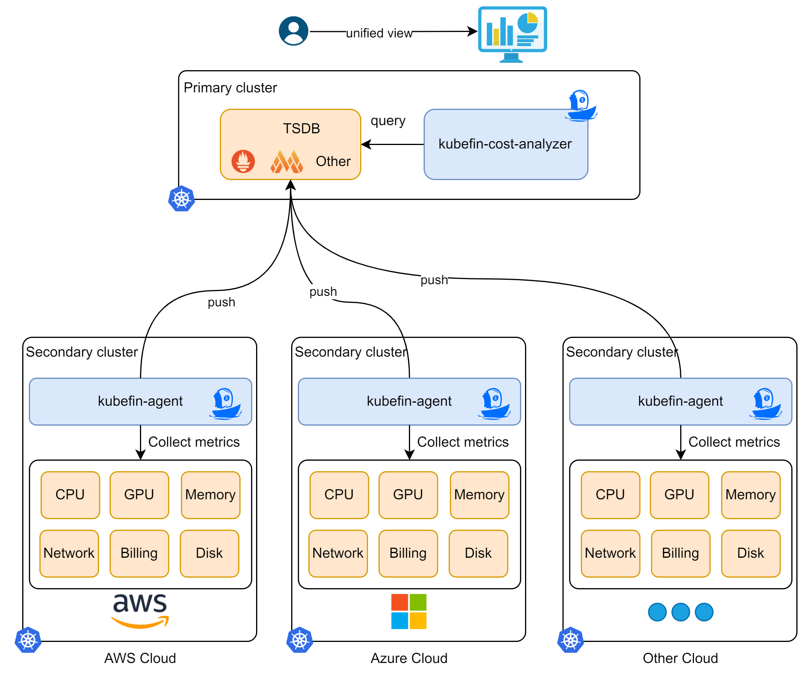

## What is KubeFin?

KubeFin is a platform built on Kubernetes that enables you to efficiently gain insights into and reduce costs for your Kubernetes clusters. With KubeFin, you can effortlessly analyze and minimize your cloud expenses, ensuring optimal utilization of resources.

Currently, the cost insights feature is supported, optimization will be available soon.

## Highlights

TBD

## What's Next

* Start to [install KubeFin](../install.md).
